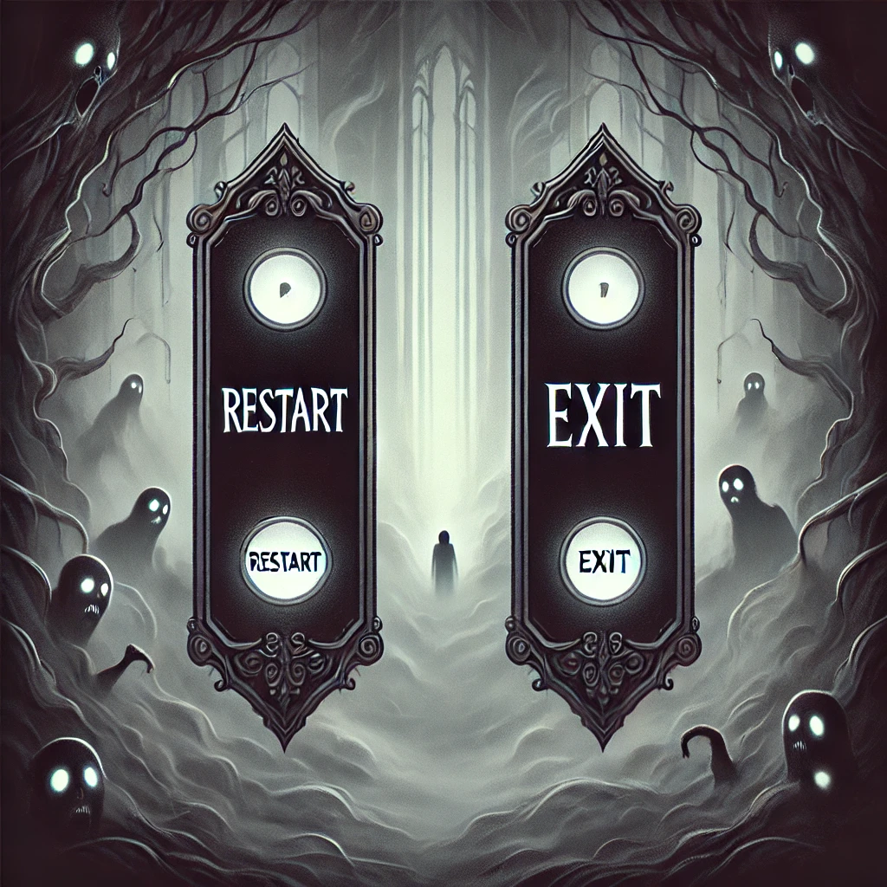
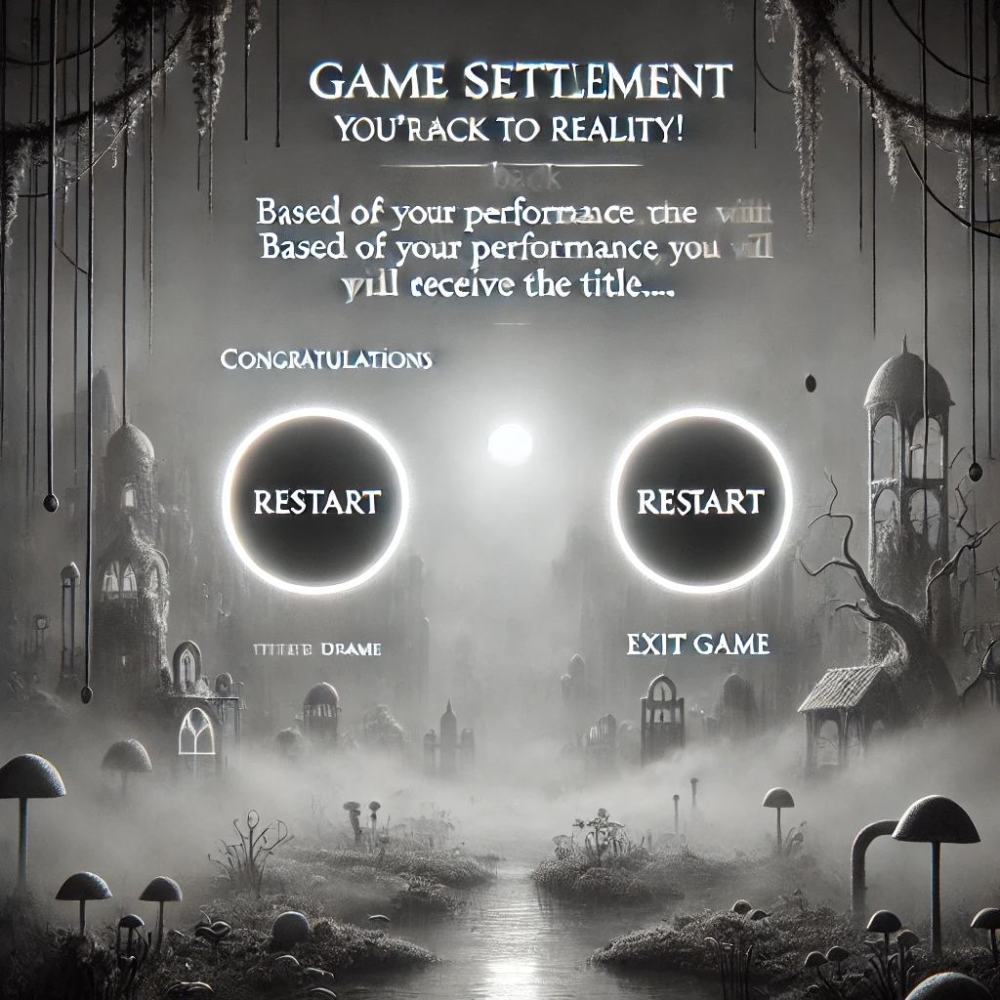

# 快逃！我不要在睡梦中越陷越深！

#### 玩法思路：

开始游戏前，有五个场景，一个现实四个梦境，玩家需要自行选择进入其中一个场景，在游戏过程中需要分清当下是处于梦境还是现实，最终在现实场景中走到最后打败boss才算通关

#### 场景选择与切换：

五个场景按顺序12345排列，开始时先让玩家选择一个场景（选择方式是鼠标左键点击），每个场景中有能切换场景的道具，每切换一个场景会==回到起点==重新开始

玩家死亡会弹出窗口让玩家选择重新开始或者结束游戏

被摄梦怪的摄梦球击中，或者触碰传送门会随机进入一个场景

每个场景最后有个旗帜（现实场景只有击败boss才会出现），玩家接触到旗帜直接切换到结算界面

#### 关卡设计：

 现实场景一切正常，符合正常的自然现象和原理，但现实中闯关难度较大（小怪较多，陷阱比较阴间），梦境场景会存在异常现象，如不正常的自然现象，小怪有时候不会攻击玩家，玩家需要发现异常并找到转梦珠来切换场景。

梦境场景基本与现实一致，玩家在梦境中遇到的困难也会在现实中遇到（致命陷阱，死路，打不过的boss，最终boss的弱点等等），玩家在甄别现实与梦境的时候也需要从梦境中获取经验，从而在现实中更加顺畅

#### 获胜与死亡：

win：在**现实**中闯过重重关卡并且击败最终boss

loss：在梦境中走到最后没有回归现实；血量为0

#### ==称号机制：==

在后台分别记录玩家在现实世界的时间和梦境世界的时间，如果玩家最后在现实世界打败boss闯关成功，按照玩家在梦境世界中的时间百分比给出以下称号（时间范围左开右闭）：

0~25：现实守卫者  

25~50：现实归途者  

50~75：梦境徘徊者

大于75：梦网迷失者

如果玩家一直在现实世界并且走到了最后，则不用计算百分比，直接给出称号：觉醒之主

如果玩家在梦境世界走到了最后，则不用计算百分比，直接给出称号：迷梦沉溺者

#### 角色设定：

大小32*32，角色双形态，剑客和法师，切换形态时有类似孙悟空筋斗云变身的动画，每种形态有自己的血量和伤害，剑客血量2000伤害-50，武器为长剑，宽10长20；法师血量1000伤害-100，武器为法杖，发射圆形法球，半径为8

==*<u>正常行走速度待定，闪避是正常行走速度的两倍（程序实操设置）</u>*==

#### 攻击方式：

近战形态：鼠标左键触发，能对前方90角度（上下45°）16半径的扇形区域内的敌人发动攻击，连续点击时触发三段式：下劈-上挑-前刺（单击无延迟，触发三段式后会有0.5秒延迟）

远攻形态：鼠标左键点哪里法球往哪里射，不会自动锁敌，向指针位置射出<u>*==速度为n，生命周期为m====（实操时程序来====定）==*</u>==，半径为8的圆形法球，

#### 键位设置：

w跳跃，s下蹲，a向后，d向前，x转换形态，==shift疾跑，space闪避==，r拾取道具，12345使用道具（道具栏只有五个空），

==鼠标左键：==

1.开始游戏时进行选择，“开始游戏”或者“退出游戏”

2.游戏中，玩家的攻击键，场景切换时单击选择场景

3.死亡或者结束时进行选择，“退出游戏”或者“重新开始”

==鼠标右键：==单击，点到哪个道具即为丢弃该道具（被丢弃的道具直接消失）

#### 道具、小怪与陷阱：

**注：除摄梦珠外所有的道具和陷阱都固定存在，拾取使用丢弃后道具立马消失，陷阱无法摧毁；只要进入敌人的移动范围，敌人就会锁定主角，除boss外敌人一旦没血直接消失，boss倒地五秒后消失**

**道具框：**五个空格，填充顺序按空格顺序，填充进空格里的道具不会被后面补上的道具排挤出去，也不会因为前面有空缺而离开自己的位置

**转梦珠：**有不同颜色，一种颜色对应一个场景，一个转梦珠只能切换到其特定场景，每个场景中只存在四种切换其他场景的转梦珠，==击败摄梦怪后掉落==，为一次性消耗品，一局游戏中用过该转梦珠即消失

**传送门：**一个场景只有一个传送门，随机传送到一个非当下场景的场景，隐藏在阴间的角落

**金钟罩：**一次性消耗品，十秒无敌时间（免疫所有攻击和伤害）

**回血露：**一次性消耗品，恢复500血量

**近战小怪：**地面上，在以自己为中心半径160范围内前后行走，速度与主角正常行走一致，生命值500，拿刀近战攻击-50

**远战小怪：**浮空，在以自己为中心半径80圆形范围自由移动，速度与主角正常行走一致，生命值400，法球远程攻击-75，速度与玩家法球速度一致

**摄梦怪**：在以自己为中心半径160圆形范围自由移动，速度是主角正常行走的两倍；生命值1000，无伤害，但是会发出摄梦球，速度与玩家法球速度一致；击中玩家则会强迫玩家随机进入一个场景（可能梦境可能现实），击败摄梦怪会掉落转梦珠

**大boss**：黑化奶龙。只存在于现实场景中的尽头，生命值5000，近战-100，远攻-100，移动是主角正常移动速度两倍，远攻火球速度是主角法球速度的两倍

**陷阱：**地刺，电锯头，天降尖刺和冰球，火，伤害均-50

## 程序需求

主角正常行走的速度，闪避速度（正常行走速度的两倍）

主角发出法球的速度，生命周期

近战小怪移动速度（与主角一致）

远攻小怪移动速度和法球速度、周期（都与主角一致）

摄梦怪移动速度（主角正常移动两倍），法球速度、周期（与主角一致）

大boss移动速度（主角正常移动两倍），火球（主角法球速度的两倍）

## 美术需求

**起始界面：**游戏名（快逃！我不要在睡梦中越陷越深！）下面接一行小字（逃离虚幻缥缈的梦境，回归真实鲜活的现实）；两个按钮（开始游戏，退出游戏）              

**游戏中画面：**灰白空间，迷雾剧场，透露出不真实感，大小先定1024*1024（最好是可以自然拼接的），主角的血条框在左下角，道具框在血条框下面，怪物的血条在自己头上，boss血条在画面正上方，背景参考如下：

**切换画面：**玩家死亡时，参考如下：

**结算画面**：“恭喜你回到了现实！根据你的表现，你将获得 ‘ 觉醒之主/现实守卫者/现实归途者/梦境徘徊者/梦网迷失者 ’ 的称号”；“很遗憾，你没有逃出梦境！根据你的表现，你将获得 ‘ 迷梦沉溺者 ’ 的称号；两个按钮（重新开始，退出游戏），参考如下：

**主角:**

整体大小32*32，角色双形态，剑客和法师，切换形态时有类似孙悟空筋斗云变身的升起和消失，长剑宽10长20；法杖宽10长20，发射半径为8蓝色法球
几种形态：跳跃，下蹲，疾跑，闪避，下劈-上挑-前刺，挥动法杖，发出蓝色法球，受到伤害时，死亡

五个血条框：红色长方形条，==扣血和加血====（血量的消失和填充是需要美术素材还是程序可以实现====？）==，宽都为16，五个长（40，50，100，150，500）
道具框：木材质，五个20*20的空格

转梦珠：水晶球模型，半径为8的球
传送门：经典魔法门，32×32
金钟罩：顾名思义，32×32
回血露：水滴形态，长16

近战小怪：32×32的骷髅，下劈，木刀宽10长20
远攻小怪：32×32的巫师怪，法杖宽10长20，挥动法杖，半径为8灰色法球
摄梦怪：32×32的白色鬼魂，无武器，胸前有个黑洞，半径为8白色法球
大boss：256×256的黑色奶龙，拳击和脚踏，吐息，半径为16的红色球，死亡形态（倒地）

四段BGM：进行游戏时诡异阴森的音乐（单曲循环即可），起始音乐，梦境结局和现实结局（直接找纯音乐）